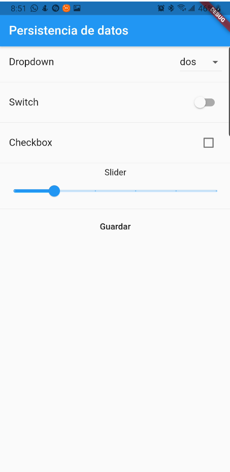
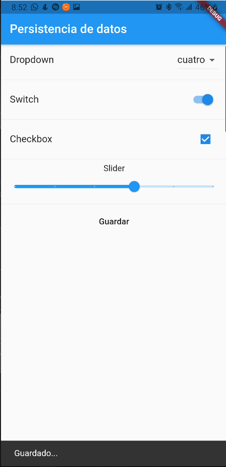

# App 11
App para practicar el uso de Hive y BLoC

## Getting Started

Recuerda que despues de clonar el proyecto, abrir una terminal dentro de la carpeta del proyecto y ejecutar el comando:

```sh
flutter packages get
``` 




## Getting Started

This project is a starting point for a Flutter application.

A few resources to get you started if this is your first Flutter project:

- [Lab: Write your first Flutter app](https://flutter.dev/docs/get-started/codelab)
- [Cookbook: Useful Flutter samples](https://flutter.dev/docs/cookbook)

For help getting started with Flutter, view our
[online documentation](https://flutter.dev/docs), which offers tutorials,
samples, guidance on mobile development, and a full API reference.
